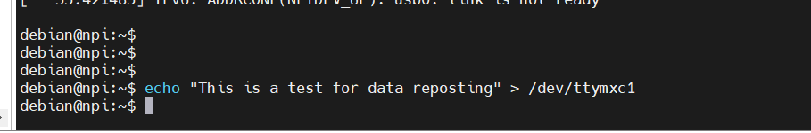
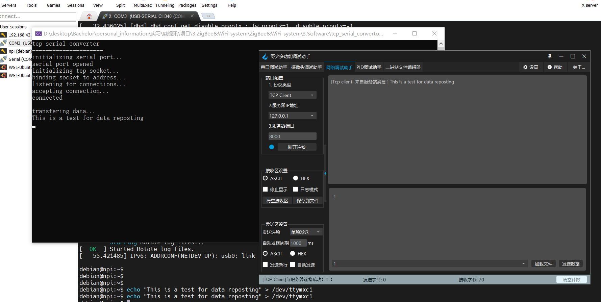
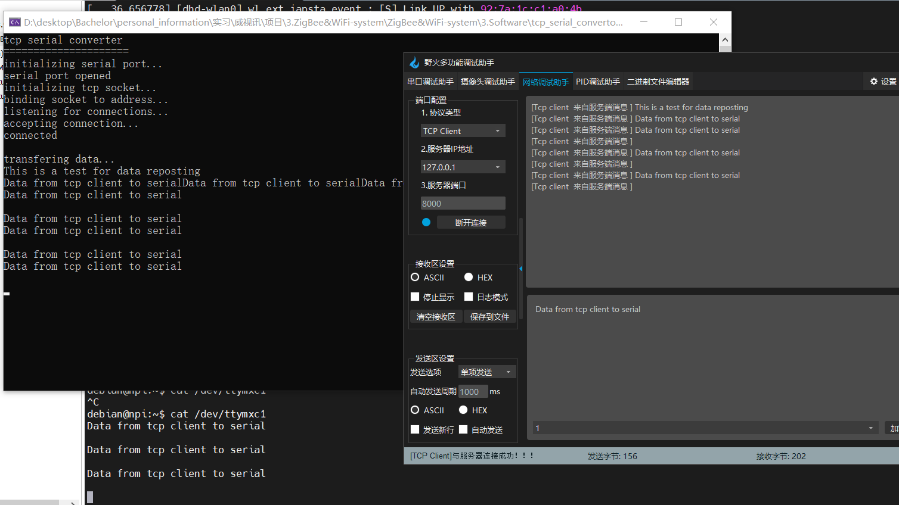

# tcp_serial_convertor

## 组成  
### 串口
使用[serial库](https://github.com/wjwwood/serial)，实现与串口间的通信。
### tcp
通过winsokc2的API，与客户端进行通信。

## 原理
先根据串口库中的例程初始化串口，根据自己串口的实际值（我这显示的是COM3），构造serial类并初始化。
然后socket、bind、listen初始化tcp服务器，并通过accept与客户端连接。
完成串口和tcp初始化后，开启两个线程，实现串口与tcp间的互传转发。两个线程均是读取串口（tcp）的数据，再发送至tcp客户端（串口）。

## 测试
首先运行程序（tcp服务器），然后使用网络调试助手进行连接。

![attachments/connect.png]

显示连接成功后，就可以测试数据转发功能了。  
这里使用一块Linux开发板传输数据进行测试，也可以使用stm32、51或者arduino替换。不过我使用vspd虚拟串口进行测试好像有些问题，这个库没读出来，貌似必须用真实的串口进行测试。  

配置好串口后，写命令行控制串口发送数据。

然后上位机接收到了数据,通过tcp转发给客户端了，客户端也显示接收到了数据。

再测试tcp客户端发送至串口。通过命令行控制串口接收数据，然后tcp发送一行数据，上位机显示已接收到，并通过串口转发给linux开发板，最终也在终端显示出串口接收到的数据。  

最后功能验证无误。